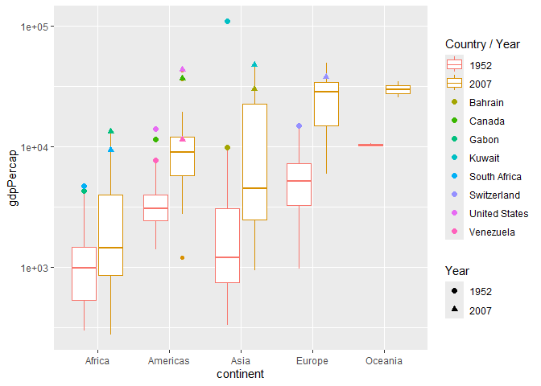

Gapminder
================
Michaela Fox
2025-02-26

- [Grading Rubric](#grading-rubric)
  - [Individual](#individual)
  - [Submission](#submission)
- [Guided EDA](#guided-eda)
  - [**q0** Perform your “first checks” on the dataset. What variables
    are in
    this](#q0-perform-your-first-checks-on-the-dataset-what-variables-are-in-this)
  - [dataset?](#dataset)
  - [**q1** Determine the most and least recent years in the `gapminder`
    dataset.](#q1-determine-the-most-and-least-recent-years-in-the-gapminder-dataset)
  - [**q2** Filter on years matching `year_min`, and make a plot of the
    GDP per capita against continent. Choose an appropriate `geom_` to
    visualize the data. What observations can you
    make?](#q2-filter-on-years-matching-year_min-and-make-a-plot-of-the-gdp-per-capita-against-continent-choose-an-appropriate-geom_-to-visualize-the-data-what-observations-can-you-make)
  - [**q3** You should have found *at least* three outliers in q2 (but
    possibly many more!). Identify those outliers (figure out which
    countries they
    are).](#q3-you-should-have-found-at-least-three-outliers-in-q2-but-possibly-many-more-identify-those-outliers-figure-out-which-countries-they-are)
  - [**q4** Create a plot similar to yours from q2 studying both
    `year_min` and `year_max`. Find a way to highlight the outliers from
    q3 on your plot *in a way that lets you identify which country is
    which*. Compare the patterns between `year_min` and
    `year_max`.](#q4-create-a-plot-similar-to-yours-from-q2-studying-both-year_min-and-year_max-find-a-way-to-highlight-the-outliers-from-q3-on-your-plot-in-a-way-that-lets-you-identify-which-country-is-which-compare-the-patterns-between-year_min-and-year_max)
- [Your Own EDA](#your-own-eda)
  - [**q5** Create *at least* three new figures below. With each figure,
    try to pose new questions about the
    data.](#q5-create-at-least-three-new-figures-below-with-each-figure-try-to-pose-new-questions-about-the-data)

*Purpose*: Learning to do EDA well takes practice! In this challenge
you’ll further practice EDA by first completing a guided exploration,
then by conducting your own investigation. This challenge will also give
you a chance to use the wide variety of visual tools we’ve been
learning.

<!-- include-rubric -->

# Grading Rubric

<!-- -------------------------------------------------- -->

Unlike exercises, **challenges will be graded**. The following rubrics
define how you will be graded, both on an individual and team basis.

## Individual

<!-- ------------------------- -->

| Category | Needs Improvement | Satisfactory |
|----|----|----|
| Effort | Some task **q**’s left unattempted | All task **q**’s attempted |
| Observed | Did not document observations, or observations incorrect | Documented correct observations based on analysis |
| Supported | Some observations not clearly supported by analysis | All observations clearly supported by analysis (table, graph, etc.) |
| Assessed | Observations include claims not supported by the data, or reflect a level of certainty not warranted by the data | Observations are appropriately qualified by the quality & relevance of the data and (in)conclusiveness of the support |
| Specified | Uses the phrase “more data are necessary” without clarification | Any statement that “more data are necessary” specifies which *specific* data are needed to answer what *specific* question |
| Code Styled | Violations of the [style guide](https://style.tidyverse.org/) hinder readability | Code sufficiently close to the [style guide](https://style.tidyverse.org/) |

## Submission

<!-- ------------------------- -->

Make sure to commit both the challenge report (`report.md` file) and
supporting files (`report_files/` folder) when you are done! Then submit
a link to Canvas. **Your Challenge submission is not complete without
all files uploaded to GitHub.**

``` r
library(tidyverse)
```

    ## ── Attaching core tidyverse packages ──────────────────────── tidyverse 2.0.0 ──
    ## ✔ dplyr     1.1.4     ✔ readr     2.1.5
    ## ✔ forcats   1.0.0     ✔ stringr   1.5.1
    ## ✔ ggplot2   3.5.1     ✔ tibble    3.2.1
    ## ✔ lubridate 1.9.4     ✔ tidyr     1.3.1
    ## ✔ purrr     1.0.2     
    ## ── Conflicts ────────────────────────────────────────── tidyverse_conflicts() ──
    ## ✖ dplyr::filter() masks stats::filter()
    ## ✖ dplyr::lag()    masks stats::lag()
    ## ℹ Use the conflicted package (<http://conflicted.r-lib.org/>) to force all conflicts to become errors

``` r
library(gapminder)
```

*Background*: [Gapminder](https://www.gapminder.org/about-gapminder/) is
an independent organization that seeks to educate people about the state
of the world. They seek to counteract the worldview constructed by a
hype-driven media cycle, and promote a “fact-based worldview” by
focusing on data. The dataset we’ll study in this challenge is from
Gapminder.

# Guided EDA

<!-- -------------------------------------------------- -->

First, we’ll go through a round of *guided EDA*. Try to pay attention to
the high-level process we’re going through—after this guided round
you’ll be responsible for doing another cycle of EDA on your own!

### **q0** Perform your “first checks” on the dataset. What variables are in this

### dataset?

``` r
## TASK: Do your "first checks" here!
?gapminder
```

    ## starting httpd help server ... done

``` r
head(gapminder)
```

    ## # A tibble: 6 × 6
    ##   country     continent  year lifeExp      pop gdpPercap
    ##   <fct>       <fct>     <int>   <dbl>    <int>     <dbl>
    ## 1 Afghanistan Asia       1952    28.8  8425333      779.
    ## 2 Afghanistan Asia       1957    30.3  9240934      821.
    ## 3 Afghanistan Asia       1962    32.0 10267083      853.
    ## 4 Afghanistan Asia       1967    34.0 11537966      836.
    ## 5 Afghanistan Asia       1972    36.1 13079460      740.
    ## 6 Afghanistan Asia       1977    38.4 14880372      786.

``` r
gapminder %>%
  pull(country) %>%
  unique()
```

    ##   [1] Afghanistan              Albania                  Algeria                 
    ##   [4] Angola                   Argentina                Australia               
    ##   [7] Austria                  Bahrain                  Bangladesh              
    ##  [10] Belgium                  Benin                    Bolivia                 
    ##  [13] Bosnia and Herzegovina   Botswana                 Brazil                  
    ##  [16] Bulgaria                 Burkina Faso             Burundi                 
    ##  [19] Cambodia                 Cameroon                 Canada                  
    ##  [22] Central African Republic Chad                     Chile                   
    ##  [25] China                    Colombia                 Comoros                 
    ##  [28] Congo, Dem. Rep.         Congo, Rep.              Costa Rica              
    ##  [31] Cote d'Ivoire            Croatia                  Cuba                    
    ##  [34] Czech Republic           Denmark                  Djibouti                
    ##  [37] Dominican Republic       Ecuador                  Egypt                   
    ##  [40] El Salvador              Equatorial Guinea        Eritrea                 
    ##  [43] Ethiopia                 Finland                  France                  
    ##  [46] Gabon                    Gambia                   Germany                 
    ##  [49] Ghana                    Greece                   Guatemala               
    ##  [52] Guinea                   Guinea-Bissau            Haiti                   
    ##  [55] Honduras                 Hong Kong, China         Hungary                 
    ##  [58] Iceland                  India                    Indonesia               
    ##  [61] Iran                     Iraq                     Ireland                 
    ##  [64] Israel                   Italy                    Jamaica                 
    ##  [67] Japan                    Jordan                   Kenya                   
    ##  [70] Korea, Dem. Rep.         Korea, Rep.              Kuwait                  
    ##  [73] Lebanon                  Lesotho                  Liberia                 
    ##  [76] Libya                    Madagascar               Malawi                  
    ##  [79] Malaysia                 Mali                     Mauritania              
    ##  [82] Mauritius                Mexico                   Mongolia                
    ##  [85] Montenegro               Morocco                  Mozambique              
    ##  [88] Myanmar                  Namibia                  Nepal                   
    ##  [91] Netherlands              New Zealand              Nicaragua               
    ##  [94] Niger                    Nigeria                  Norway                  
    ##  [97] Oman                     Pakistan                 Panama                  
    ## [100] Paraguay                 Peru                     Philippines             
    ## [103] Poland                   Portugal                 Puerto Rico             
    ## [106] Reunion                  Romania                  Rwanda                  
    ## [109] Sao Tome and Principe    Saudi Arabia             Senegal                 
    ## [112] Serbia                   Sierra Leone             Singapore               
    ## [115] Slovak Republic          Slovenia                 Somalia                 
    ## [118] South Africa             Spain                    Sri Lanka               
    ## [121] Sudan                    Swaziland                Sweden                  
    ## [124] Switzerland              Syria                    Taiwan                  
    ## [127] Tanzania                 Thailand                 Togo                    
    ## [130] Trinidad and Tobago      Tunisia                  Turkey                  
    ## [133] Uganda                   United Kingdom           United States           
    ## [136] Uruguay                  Venezuela                Vietnam                 
    ## [139] West Bank and Gaza       Yemen, Rep.              Zambia                  
    ## [142] Zimbabwe                
    ## 142 Levels: Afghanistan Albania Algeria Angola Argentina Australia ... Zimbabwe

``` r
gapminder %>%
  pull(continent) %>%
  unique()
```

    ## [1] Asia     Europe   Africa   Americas Oceania 
    ## Levels: Africa Americas Asia Europe Oceania

**Observations**:

- Country, continent, year, lifeExp, pop, gdpPercap

### **q1** Determine the most and least recent years in the `gapminder` dataset.

*Hint*: Use the `pull()` function to get a vector out of a tibble.
(Rather than the `$` notation of base R.)

``` r
## TASK: Find the largest and smallest values of `year` in `gapminder`
year_max <- 
  gapminder %>%
  pull(year) %>%
  max()
  
year_min <- 
  gapminder %>%
  pull(year) %>%
  min()
```

Use the following test to check your work.

``` r
## NOTE: No need to change this
assertthat::assert_that(year_max %% 7 == 5)
```

    ## [1] TRUE

``` r
assertthat::assert_that(year_max %% 3 == 0)
```

    ## [1] TRUE

``` r
assertthat::assert_that(year_min %% 7 == 6)
```

    ## [1] TRUE

``` r
assertthat::assert_that(year_min %% 3 == 2)
```

    ## [1] TRUE

``` r
if (is_tibble(year_max)) {
  print("year_max is a tibble; try using `pull()` to get a vector")
  assertthat::assert_that(False)
}

print("Nice!")
```

    ## [1] "Nice!"

### **q2** Filter on years matching `year_min`, and make a plot of the GDP per capita against continent. Choose an appropriate `geom_` to visualize the data. What observations can you make?

You may encounter difficulties in visualizing these data; if so document
your challenges and attempt to produce the most informative visual you
can.

``` r
## TASK: Create a visual of gdpPercap vs continent
gapminder %>%
  filter(year == year_min) %>%
  ggplot(aes(x = continent, y = gdpPercap)) + 
  geom_boxplot()
```

<!-- -->

**Observations**:

- Most continents have a relatively low GDP per capita with a relatively
  small spread. The median for all countries does not pass 30000
- Oceania has both the smallest GDP per capita spread and the highest
  median, suggesting the GDP per capita of its countries is relatively
  similar.
- The Americas, Africa, Asia, and Europe all have noticeable outliers,
  with Asia having a very high outlier.
- Europe has the largest spead.
- All the outliers seem to be greater than the upper bound, not lower.

**Difficulties & Approaches**:

- I originally tried a scatter plot, but the points were so close
  together it was difficult to tell where they were, and I was also not
  entirely sure were the outliers were except for one. I then tried a
  boxplot, which made it much easier to visualize the range of the data
  and see where outliers were.

### **q3** You should have found *at least* three outliers in q2 (but possibly many more!). Identify those outliers (figure out which countries they are).

``` r
## TASK: Identify the outliers from q2
gapminder %>%
  filter(year == year_min) %>%
  filter(continent == 'Africa') %>%
  arrange(desc(gdpPercap)) %>%
  head(2)
```

    ## # A tibble: 2 × 6
    ##   country      continent  year lifeExp      pop gdpPercap
    ##   <fct>        <fct>     <int>   <dbl>    <int>     <dbl>
    ## 1 South Africa Africa     1952    45.0 14264935     4725.
    ## 2 Gabon        Africa     1952    37.0   420702     4293.

``` r
gapminder %>%
  filter(year == year_min) %>%
  filter(continent == 'Americas') %>%
  arrange(desc(gdpPercap)) %>%
  head(3)
```

    ## # A tibble: 3 × 6
    ##   country       continent  year lifeExp       pop gdpPercap
    ##   <fct>         <fct>     <int>   <dbl>     <int>     <dbl>
    ## 1 United States Americas   1952    68.4 157553000    13990.
    ## 2 Canada        Americas   1952    68.8  14785584    11367.
    ## 3 Venezuela     Americas   1952    55.1   5439568     7690.

``` r
gapminder %>%
  filter(year == year_min) %>%
  filter(continent == 'Asia') %>%
  arrange(desc(gdpPercap)) %>%
  head(2)
```

    ## # A tibble: 2 × 6
    ##   country continent  year lifeExp    pop gdpPercap
    ##   <fct>   <fct>     <int>   <dbl>  <int>     <dbl>
    ## 1 Kuwait  Asia       1952    55.6 160000   108382.
    ## 2 Bahrain Asia       1952    50.9 120447     9867.

``` r
gapminder %>%
  filter(year == year_min) %>%
  filter(continent == 'Europe') %>%
  arrange(desc(gdpPercap)) %>%
  head(1)
```

    ## # A tibble: 1 × 6
    ##   country     continent  year lifeExp     pop gdpPercap
    ##   <fct>       <fct>     <int>   <dbl>   <int>     <dbl>
    ## 1 Switzerland Europe     1952    69.6 4815000    14734.

**Observations**:

- Identify the outlier countries from q2
  - Africa: South Africa, Gabon
  - Americas: USA, Canada, Venezuela
  - Asia: Kuwait, Bahrain
  - Europe: Switzerland

*Hint*: For the next task, it’s helpful to know a ggplot trick we’ll
learn in an upcoming exercise: You can use the `data` argument inside
any `geom_*` to modify the data that will be plotted *by that geom
only*. For instance, you can use this trick to filter a set of points to
label:

``` r
## NOTE: No need to edit, use ideas from this in q4 below
gapminder %>%
  filter(year == max(year)) %>%

  ggplot(aes(continent, lifeExp)) +
  geom_boxplot() +
  geom_point(
    data = . %>% filter(country %in% c("United Kingdom", "Japan", "Zambia")),
    mapping = aes(color = country),
    size = 2
  )
```

<!-- -->

### **q4** Create a plot similar to yours from q2 studying both `year_min` and `year_max`. Find a way to highlight the outliers from q3 on your plot *in a way that lets you identify which country is which*. Compare the patterns between `year_min` and `year_max`.

*Hint*: We’ve learned a lot of different ways to show multiple
variables; think about using different aesthetics or facets.

``` r
## TASK: Create a visual of gdpPercap vs continent
gapminder %>%
  filter(year %in% c(year_min, year_max)) %>%
  ggplot(aes(x = continent, y = gdpPercap, group = interaction(continent, factor(year)))) + 
  geom_boxplot(aes(color = factor(year))) +  # Boxplots colored by year
  geom_point(
    data = gapminder %>% filter(year %in% c(year_min, year_max), 
                                country %in% c("South Africa", "Gabon", "United States", "Canada", "Venezuela", "Kuwait", "Bahrain", "Switzerland")),
    aes(x = continent, y = gdpPercap, color = country, shape = factor(year)),  # Differentiate years
    size = 2,
    position = position_dodge(width = 0.75)  # Properly align dots with boxplots
  ) +
  labs(color = "Country / Year", shape = "Year")
```

<!-- -->

**Observations**:

- Africa gained more outliers between 1952 and 2007.
- The median and range tended to increase between 1952 and 2007 - does
  this dataset take inflation into account?
- Kuwait’s GDP decreased significantly between 1952 and 2007, it is the
  only 1952 outlier country to show this behavior.

# Your Own EDA

<!-- -------------------------------------------------- -->

Now it’s your turn! We just went through guided EDA considering the GDP
per capita at two time points. You can continue looking at outliers,
consider different years, repeat the exercise with `lifeExp`, consider
the relationship between variables, or something else entirely.

### **q5** Create *at least* three new figures below. With each figure, try to pose new questions about the data.

``` r
## TASK: Your first graph - Life Expectancy vs. Time
gapminder %>%
  ggplot(aes(x = continent, y = lifeExp, group = interaction(continent, factor(year)))) + 
  geom_boxplot(aes(color = factor(year)))  # Boxplots colored by year
```

<!-- -->

- For all continents life expectancy increased over time.
- This could imply that life expectancy and GDP are directly related.

``` r
## TASK: Your second graph - Median Life Expectancy vs. GDP for all continents
gapminder %>%
  group_by(continent, year) %>%
  mutate(med_lifeExp = median(lifeExp), med_gdpPercap = median(gdpPercap)) %>%
  ggplot(aes(x = med_gdpPercap, y = med_lifeExp)) +
  geom_line(aes(color = continent), size = 0.6)
```

    ## Warning: Using `size` aesthetic for lines was deprecated in ggplot2 3.4.0.
    ## ℹ Please use `linewidth` instead.
    ## This warning is displayed once every 8 hours.
    ## Call `lifecycle::last_lifecycle_warnings()` to see where this warning was
    ## generated.

<!-- -->

- Africa, Asia, and the Americas had sharp increases in life expectancy
  while their GDP did not change nearly as much.
- Europe and Oceania were the opposite and had greater changes in GDP
  than life expectancy.
- For all continents life expectancy tended to increase with GDP, giving
  evidence to the hypothesis made in the first graph.
- However, the increase was different for all countries, implying that
  GDP was not the only factor influencing life expectancy, and vice
  versa.

``` r
## TASK: Your third graph - Life Expectancy vs. Population
gapminder %>%
  group_by(continent, year) %>%
  mutate(med_lifeExp = median(lifeExp), med_pop = median(pop)) %>%
  ggplot(aes(x = med_pop, y = med_lifeExp)) +
  geom_line(aes(color = continent), size = 0.6)
```

<!-- -->

``` r
# GDP vs. Time
gapminder %>%
  group_by(continent, year) %>%
  mutate(med_GDP = median(gdpPercap)) %>%
  ggplot(aes(x = year, y = med_GDP)) +
  geom_line(aes(color = continent), size = 0.6) +
  scale_y_log10() 
```

<!-- -->

``` r
gapminder %>%
  filter(continent == "Asia") %>%
  group_by(year) %>%
  summarize(med_GDP = median(gdpPercap), .groups = "drop") %>%
  arrange(desc(med_GDP)) %>%  # Sort in descending order
  slice_head(n = 5)  # Select the top 5 years
```

    ## # A tibble: 5 × 2
    ##    year med_GDP
    ##   <int>   <dbl>
    ## 1  2007   4471.
    ## 2  1982   4107.
    ## 3  1987   4106.
    ## 4  2002   4091.
    ## 5  1992   3726.

``` r
gapminder %>%
  filter(continent == "Africa") %>%
  group_by(year) %>%
  summarize(med_GDP = median(gdpPercap), .groups = "drop") %>%
  arrange(desc(med_GDP)) %>%  # Sort in descending order
  slice_head(n = 5)  # Select the top 5 years
```

    ## # A tibble: 5 × 2
    ##    year med_GDP
    ##   <int>   <dbl>
    ## 1  2007   1452.
    ## 2  1972   1443.
    ## 3  1977   1400.
    ## 4  1982   1324.
    ## 5  1987   1220.

``` r
# Compute median life expectancy for the earliest year
min_year_lifeexp <- gapminder %>%
  filter(year == year_min) %>%
  group_by(continent) %>%
  summarize(min_med_lifeExp = median(lifeExp), .groups = "drop")

# Compute median life expectancy for the latest year
max_year_lifeexp <- gapminder %>%
  filter(year == year_max) %>%
  group_by(continent) %>%
  summarize(max_med_lifeExp = median(lifeExp), .groups = "drop")

# Join datasets and calculate the difference
lifeexp_change <- min_year_lifeexp %>%
  inner_join(max_year_lifeexp, by = "continent") %>%
  mutate(lifeExp_difference = max_med_lifeExp - min_med_lifeExp)
```

- Population and life expectancy are related, when one increases, so
  does the other.
- For most continents, life expectancy plateaus once it reaches a
  certain point.
