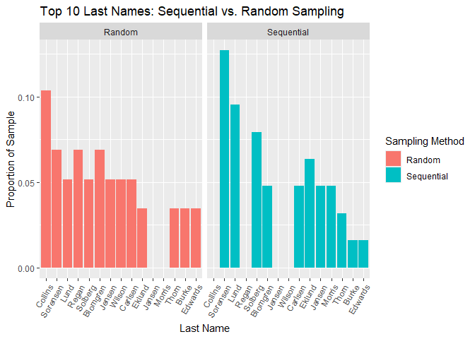
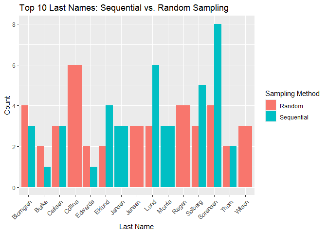
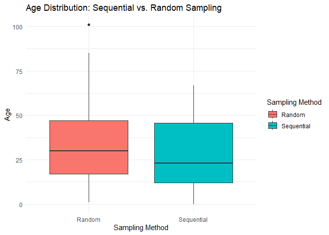

The Islands, Part 1: Design
================
Michaela Fox
2025-03-27

- [Grading Rubric](#grading-rubric)
  - [Individual](#individual)
  - [Submission](#submission)
- [Setup](#setup)
  - [**q1** Orientation](#q1-orientation)
  - [**q2** Occupied homes](#q2-occupied-homes)
  - [**q3** Find common names: Sequential
    sample](#q3-find-common-names-sequential-sample)
  - [**q4** Plan a random sample](#q4-plan-a-random-sample)
  - [**q5** Collect the random sample](#q5-collect-the-random-sample)
  - [**q6** Find common names: Random
    sample](#q6-find-common-names-random-sample)
  - [**q7** Write a helper function](#q7-write-a-helper-function)
  - [**q8** Construct a bootstrap confidence
    interval](#q8-construct-a-bootstrap-confidence-interval)
  - [**q9** Discover possible
    measurements](#q9-discover-possible-measurements)
  - [**q10** Planning a study
    (TEAMWORK)](#q10-planning-a-study-teamwork)

*Purpose*: So far in this class, I’ve handed you each dataset. But much
of the important work of statistics happens *before* data collection.
Issues with data collection generally can’t be fixed by fancy analysis
after the fact. Therefore, in this *two part* challenge, you will first
*plan* and then *execute* a statistical project.

To do this, we’ll make use of The Islands, an extremely detailed
simulation of a virtual population, developed by researchers at the
University of Queensland. This is a fascinating sandbox that helps
illustrate the difficulties and complexities of collecting real data,
while still being more tractable than collecting data from real humans.

This is part 1 of 2. In this part you will *plan* your statistical
project, particularly your data collection. Sound data collection is
called *statistical design*.

<!-- include-rubric -->

# Grading Rubric

<!-- -------------------------------------------------- -->

Unlike exercises, **challenges will be graded**. The following rubrics
define how you will be graded, both on an individual and team basis.

## Individual

<!-- ------------------------- -->

| Category | Needs Improvement | Satisfactory |
|----|----|----|
| Effort | Some task **q**’s left unattempted | All task **q**’s attempted |
| Observed | Did not document observations, or observations incorrect | Documented correct observations based on analysis |
| Supported | Some observations not clearly supported by analysis | All observations clearly supported by analysis (table, graph, etc.) |
| Assessed | Observations include claims not supported by the data, or reflect a level of certainty not warranted by the data | Observations are appropriately qualified by the quality & relevance of the data and (in)conclusiveness of the support |
| Specified | Uses the phrase “more data are necessary” without clarification | Any statement that “more data are necessary” specifies which *specific* data are needed to answer what *specific* question |
| Code Styled | Violations of the [style guide](https://style.tidyverse.org/) hinder readability | Code sufficiently close to the [style guide](https://style.tidyverse.org/) |

## Submission

<!-- ------------------------- -->

Make sure to commit both the challenge report (`report.md` file) and
supporting files (`report_files/` folder) when you are done! Then submit
a link to Canvas. **Your Challenge submission is not complete without
all files uploaded to GitHub.**

# Setup

<!-- ----------------------------------------------------------------------- -->

``` r
library(tidyverse)
```

    ## ── Attaching core tidyverse packages ──────────────────────── tidyverse 2.0.0 ──
    ## ✔ dplyr     1.1.4     ✔ readr     2.1.5
    ## ✔ forcats   1.0.0     ✔ stringr   1.5.1
    ## ✔ ggplot2   3.5.1     ✔ tibble    3.2.1
    ## ✔ lubridate 1.9.4     ✔ tidyr     1.3.1
    ## ✔ purrr     1.0.2     
    ## ── Conflicts ────────────────────────────────────────── tidyverse_conflicts() ──
    ## ✖ dplyr::filter() masks stats::filter()
    ## ✖ dplyr::lag()    masks stats::lag()
    ## ℹ Use the conflicted package (<http://conflicted.r-lib.org/>) to force all conflicts to become errors

``` r
library(rsample)

filename_random <- "./data/helvig-random.csv"
```

### **q1** Orientation

Log into [The Islands](https://islands.smp.uq.edu.au/index.php) and head
to the [Visitor Center](https://islands.smp.uq.edu.au/visitors.php) on
Providence island (to the east). Watch the first three videos on the
`Guides` tab.

*Note:* There is no deliverable for this task. BUT, you’ll need to be
oriented to The Islands in order to do *any* of the tasks below.

The Islands is an *incredibly* detailed simulation of a real population.
Islanders are born, die, and move around. The Islands was designed as a
teaching tool to help students learn how to apply statistics to
collecting data in the real world.

### **q2** Occupied homes

Find the total number of homes in Helvig, and count the number of
unoccupied homes. Answer the questions below.

NB. When Zach counted the homes (on 2025-01-08), he found 20 unoccupied
out of 536 total. That means the occupied percentage was about 96%. But
you still need to count, because your numbers *will* be different!

**Observations**:

- What is the total number of homes in Helvig?
  - 551
- What is the number of unoccupied homes? (*Hint*: This is not given
  anywhere. You will have to count them!)
  - 17
- What percent of homes are *occupied*?
  - 97%
- Are there any sources of *real* uncertainty in the percent occupied
  you calculated?
  - Yes, because The Islands is a real-time simulation where islanders
    are born, die, and move. As a result, the number of occupied and
    unoccupied homes can change over time, introducing real uncertainty.
- Are there any sources of *erroneous* uncertainty in the percent
  occupied you calculated?
  - Yes, I could have miscounted,.

Zach looked at the first 25 homes in Helvig and recorded the `age` and
`name` of every person in those homes. These people are provided in
`helvig-seq.csv`.

``` r
## NOTE: Do not edit this
df_sample_seq <- read_csv("./data/helvig-seq.csv")
```

    ## Rows: 63 Columns: 3
    ## ── Column specification ────────────────────────────────────────────────────────
    ## Delimiter: ","
    ## chr (1): name
    ## dbl (2): house, age
    ## 
    ## ℹ Use `spec()` to retrieve the full column specification for this data.
    ## ℹ Specify the column types or set `show_col_types = FALSE` to quiet this message.

``` r
df_sample_seq 
```

    ## # A tibble: 63 × 3
    ##    house   age name             
    ##    <dbl> <dbl> <chr>            
    ##  1     1    58 Arvid Thorn      
    ##  2     1    55 Benjamin Connolly
    ##  3     2    46 Remy Tiwari      
    ##  4     2    44 Sophia Solberg   
    ##  5     2    14 Illona Solberg   
    ##  6     2    12 William Tiwari   
    ##  7     2    10 Hans Solberg     
    ##  8     3    24 Kaya Carlsen     
    ##  9     3    23 Julian Eklund    
    ## 10     3     4 Katharina Carlsen
    ## # ℹ 53 more rows

You’ll use this dataset as a starting point to figure out prevalent
*last names* in Helvig.

### **q3** Find common names: Sequential sample

Complete the code below to find the prevalence of the most common *last
name* in Helvig using the sample `df_sample_seq`. Answer the questions
below.

Make sure to include in `df_q3` the counts as a column named `n`, and
the prevalence (number of occurrence divided by total people) as a
column `p`. Also, make sure to sort the data in *descending* order of
prevalence.

*Hint*: You will have to use what you’ve learned about string handling
to extract the *last names* only!

``` r
## TASK: Compute the prevalence and sort
df_q3 <- 
  df_sample_seq %>% 
## TODO: Complete this code
  mutate(last_name = str_extract(name, "\\S+$")) %>%  
  group_by(last_name) %>%
  summarise(n = n(), .groups = "drop") %>%
  mutate(p = n / sum(n)) %>%
  arrange(desc(p))

df_q3
```

    ## # A tibble: 28 × 3
    ##    last_name     n      p
    ##    <chr>     <int>  <dbl>
    ##  1 Sorensen      8 0.127 
    ##  2 Lund          6 0.0952
    ##  3 Solberg       5 0.0794
    ##  4 Eklund        4 0.0635
    ##  5 Blomgren      3 0.0476
    ##  6 Carlsen       3 0.0476
    ##  7 Jansen        3 0.0476
    ##  8 Morris        3 0.0476
    ##  9 Banerjee      2 0.0317
    ## 10 Chunduri      2 0.0317
    ## # ℹ 18 more rows

Use the following to check your work.

``` r
## NOTE: No need to change this
## Check that data has `p` column and is in descending order
assertthat::assert_that(
              all(df_q3 %>%
                 mutate(d = p - lead(p)) %>% 
                 filter(!is.na(d)) %>% 
                 pull(d) >= 0
              )
            )
```

    ## [1] TRUE

``` r
print("Very good!")
```

    ## [1] "Very good!"

*Observations*

- What last name is most prevalent in `df_sample_seq`?
  - Sorensen
- Is this sample representative of *all* houses in Helvig? Why or why
  not?
  - No, because it only includes 25 homes, which is a small fraction of
    the total number of homes in Helvig.

In the exercises, we talked about the importance of random sampling. In
the previous challenge, we were able to *simulate* a random sample by
running a few lines of code. But in the real world, we have to work
harder to gather a random sample. We’ll do this in two stages: *plan*
then *collect*.

### **q4** Plan a random sample

Complete the code below to draw a sample of size `n=25`. Replace
`n_houses` with the (current) total number in Helvig.

``` r
## TASK: Set the parameters for this code block

## Select a random sample of houses
n_houses <- 551 # Total number of houses
n_sample <- 25  # Desired sample size

set.seed(101)   # Set a seed for reproducibility

df_numbers_random <- 
  tibble(
    house = sample(
        1:n_houses,     # All integers from 1 to n_houses
        n_sample,       # Size of our sample
        replace = FALSE # Sample *WITHOUT* replacement
      )
  ) %>% 
  # Arrange for our data collection convenience
  arrange(house)

# Pull the column so we can list just the house numbers
df_numbers_random %>% 
  pull(house)
```

    ##  [1]  14  95  97 117 131 192 204 209 240 244 246 298 315 316 351 352 355 430 442
    ## [20] 454 474 483 504 521 550

Use the following code to check your results.

``` r
## NOTE: No need to change this
assertthat::assert_that(
  all(dim(df_numbers_random) == c(25, 1))
)
```

    ## [1] TRUE

### **q5** Collect the random sample

Gather the names of all people in the homes you listed in the previous
exercise. Match the same columns as `df_sample_seq`; those are, `house`,
`age`, `name`. Make sure to include `NA` rows for houses with no
occupants. Save your data as a CSV with the filename provided in the
variable `filename_random`. Answer the questions below.

``` r
## NOTE: Do not edit
filename_random
```

    ## [1] "./data/helvig-random.csv"

Note that this points to the `data/` subdirectory in your `challenges`
folder.

The following code will load your data.

``` r
## NOTE: Do not edit
df_sample_random <- 
  read_csv(filename_random)
```

    ## Rows: 58 Columns: 3
    ## ── Column specification ────────────────────────────────────────────────────────
    ## Delimiter: ","
    ## chr (1): name
    ## dbl (2): house, age
    ## 
    ## ℹ Use `spec()` to retrieve the full column specification for this data.
    ## ℹ Specify the column types or set `show_col_types = FALSE` to quiet this message.

Use the following to check your work.

``` r
## NOTE: No need to change this
# Check that the dataset has the correct column names
assertthat::assert_that(setequal(
  df_sample_random %>% names(),
  df_sample_seq %>% names()
))
```

    ## [1] TRUE

``` r
# Check that all of the house numbers in the dataset match those that were planned
numVsamp <- 
  anti_join(
    df_numbers_random,
    df_sample_random %>% distinct(house),
    by = "house"
  ) %>% 
  pull(house)
assertthat::assert_that(
  length(numVsamp) == 0,
  msg = str_c("You are missing the houses: ", numVsamp)
)
```

    ## [1] TRUE

``` r
sampVnum <- 
  anti_join(
    df_sample_random %>% distinct(house),
    df_numbers_random,
    by = "house"
  ) %>% 
  pull(house)
assertthat::assert_that(
  length(sampVnum) == 0,
  msg = str_c("You have extra houses: ", sampVnum)
)
```

    ## [1] TRUE

``` r
print("Great work!")
```

    ## [1] "Great work!"

*Observations*

- Which sample—sequential or random—is more *representative* of all
  homes Helvig? Why?
  - Random
  - Every house has an equal chance of being selected, preventing any
    unintentional patterns that may skew the data. This means it also
    better reflects the overall population.

### **q6** Find common names: Random sample

Run the code below to find the prevalence of the most common *last name*
in Helvig using the sample `df_sample_random`. Answer the questions
below.

``` r
# NOTE: No need to edit; run and answer the questions below
df_sample_random %>% 
  mutate(last = str_extract(name, "\\w+$")) %>% 
  count(last) %>% 
  arrange(desc(n)) %>% 
  mutate(p = n / sum(n))
```

    ## # A tibble: 26 × 3
    ##    last         n      p
    ##    <chr>    <int>  <dbl>
    ##  1 Collins      6 0.103 
    ##  2 Blomgren     4 0.0690
    ##  3 Regan        4 0.0690
    ##  4 Sorensen     4 0.0690
    ##  5 Carlsen      3 0.0517
    ##  6 Jensen       3 0.0517
    ##  7 Lund         3 0.0517
    ##  8 Solberg      3 0.0517
    ##  9 Wilson       3 0.0517
    ## 10 Burke        2 0.0345
    ## # ℹ 16 more rows

*Observations*

- Did you find any highly prevalent names using `df_sample_random` that
  you *didn’t* find in q3 (using `df_sample_seq`)? Write them here.
  - Collins, Regan, Wilson, Burke
- Is there any reason that people with the same last name might tend to
  *live near each other*?
  - Yes, relatives may want to live near each other, families from the
    same cultural or ethnic background may want to live near each other,
    and certain historical settlement patterns may influence naming in
    the area.

You should have found some difference between the sequential and random
samples. This is because we’re only working with a *sample*—a limited
number of observations from the entire population. We could go to every
single house in Helvig and determine *exactly* how many people of each
name there are (that’s called a *census*), but the point of statistical
inference is that we can make statements about a population using only a
sample. What makes statistical inference powerful is that we can
determine *how confident* we should be in our results, based on the size
of our sample.

To do this, we’ll use the bootstrap approach that you saw in the
exercise sequence. We’ll start by building a helper function.

### **q7** Write a helper function

Complete the code below to write a helper function. Your function will
compute the proportion of people in a sample that have a user-specified
last name.

``` r
## TASK: Write a helper function that takes a dataframe with full names 
#  (provided in a `name` column), removes any invalid rows, and computes the
#  proportion of individuals with the user-specified `last` name (returned
#  in an `estimate` column).
name_prevalence <- function(df, last = "Collins") {
  df %>% 
    ## TODO: Finish this code
    filter(!is.na(name)) %>%
    mutate(last_name = str_extract(name, "\\S+$")) %>%  # Extract last name
    summarise(
      estimate = mean(last_name == last)  # Compute proportion of specified last name
    ) %>%
    mutate(term = "prevalence")
}
```

Use the following code to check your results.

``` r
## NOTE: No need to change this
# Find the most prevalent name in the data
last_most <- 
  df_sample_random %>% 
  mutate(last = str_extract(name, "\\w+$")) %>% 
  count(last) %>% 
  arrange(desc(n)) %>% 
  slice(1) %>% 
  pull(last)

# Ensure correct columns
assertthat::assert_that(
  setequal(
    tibble(name = c("James")) %>% name_prevalence(., last = "James") %>% names(),
    c("term", "estimate")
  ),
  msg = "Your code should result a dataframe with just two columns: `term` and `estimate`"
)
```

    ## [1] TRUE

``` r
# Ensure NA handling
assertthat::assert_that(
  !(tibble(name = c(NA_character_, "James")) %>% 
    name_prevalence(., last = "James") %>% 
    pull(estimate) %>% 
    is.na()),
  msg = "Ensure your code properly ignores NA's"
)
```

    ## [1] TRUE

``` r
# Check for correctness
assertthat::assert_that(
  name_prevalence(df_sample_random, last = last_most) %>% pull(estimate) ==
    mean(str_detect(df_sample_random$name, last_most), na.rm = TRUE),
  msg = "Your code computed the wrong value"
)
```

    ## [1] TRUE

``` r
print("Nice!")
```

    ## [1] "Nice!"

### **q8** Construct a bootstrap confidence interval

Choose a prevalent name that you found in q6. Use bootstrap resampling
with your helper function to construct a confidence interval for the
prevalence of that name. Answer the questions below.

*Hint*: We learned how to do resampling-based inference in `e-stat09`.

``` r
# TASK: Complete the code below to compute a bootstrap-based confidence interval
df_interval_bootstrap <- 
  df_sample_random %>% 
  bootstraps(., times = 1000) %>% 
  mutate(
    estimate = map(
      splits,
      function(split_df) {
## TODO: Finish this code, using the name_prevalence() helper you implemented
## HINT: Remember that you need to use analysis() when operating on split_df
        analysis(split_df) %>% 
        name_prevalence(last = "Collins")
      }
    )
  ) %>% 
  ## NOTE: No need to edit this line; this uses your bootstrap sample to compute
  # a confidence `int`erval using the percentile method
  int_pctl(., estimate)

df_interval_bootstrap 
```

    ## # A tibble: 1 × 6
    ##   term       .lower .estimate .upper .alpha .method   
    ##   <chr>       <dbl>     <dbl>  <dbl>  <dbl> <chr>     
    ## 1 prevalence 0.0351     0.107  0.190   0.05 percentile

**Observations**:

- What is highest possible prevalence for your chosen name, based on the
  confidence interval you constructed?
  - About 19%
- Note that we used the *random* sample with the bootstrap procedure in
  this task. Could we use the bootstrap to make a confidence interval
  using the sequential sample (`df_sample_seq`) that would be
  representative of all of Helvig? Why or why not?
  - No
  - Even though the bootstrap method can help quantify uncertainty in
    sample estimates, it cannot correct for bias in the sample itself.
    Therefore, the resulting confidence interval would still reflect the
    bias of the original sample.

### **q9** Discover possible measurements

Click on a single islander (you can do this from one of the houses), and
take a look at what info they can provide. Write down three pieces of
info that you’re particularly interested in; this will inform your
quantity of interest for the final task.

*Hint*: The videos from the [Visitor
Center](https://islands.smp.uq.edu.au/visitors.php) will be especially
helpful for getting some ideas.

- Blood Glucose
- Jog Outdoors 30 min
- Beer Regular

### **q10** Planning a study (TEAMWORK)

Challenge 10 will be a team assignment where you plan and execute a
statistical study using The Islands. You should meet with your learning
team for Challenge 10 to complete the steps below—though everyone is
responsible for including the plan in their individual Challenge 08
submission.

#### Population

- (What population are you going to study?)
  - All of the Islanders? Only the residents of Helvig? Participants
    meeting certain criteria (in which case, you need to list
    *covariates*)?
  - Students at University of Arcadia

#### Quantity of interest

- Blood alcohol content
- Performance times for mental and physical tasks

#### Covariates

- Law Major
- Science Major
- Health Major
- Art Major
- Business Major

#### Observation or experiment?

The Islands allows you to ask islanders to complete tasks. If you just
take measurements on your participants, then it’s an *observational
study*. But if you also introduce something that’s meant to change the
outcome of a measurement (e.g., drinking coffee before taking a test),
that’s called an *experimental study*. You need to decide whether your
study is observational or experimental.

- Which majors are able to perform the best mentally and physically when
  under the influence of alcohol?

#### Question / Hypothesis

- Which major performs best under the influence of alcohol?
  - This could be an observational question, like “How are X and Y
    related in the population?”
  - This could be an experimental question, like “What effect does X
    have on Y in the population?”

#### Sampling plan

- (What steps will you take to collect the data?)
  - Be specific. For instance, if you’re going to collect a random
    sample, how will you enumerate all of the things to be sampled?
    - Index them and then split by major.
  - Write a protocol. Document step-by-step instructions that your team
    will follow. That way, you can feasibly split up data collection
    among the whole team, while making sure each team member doesn’t
    make ad hoc decisions that introduce bias into your results.
    - Take blood alcohol content before

      Take one coordination test

      Take one mental test

      Give them vodka (6 shots)

      Take blood alcohol content again

      Take one coordination test

      Take one mental test
- (How will you ensure the data is representative of your chosen
  population?)
  - Only pick University students
- (For experiments only: How will you ensure any effects you observe are
  due to the treatment, and not due to other factors?)
  - We will take random samples of 25 for each major.
- (How will you choose your sample size?)
  - This should be a mix of how confident you want to be in your
    results, and what is actually *feasible* for your research team.
    - 25 students for each of the chosen majors in the chosen
      University.

``` r
# Load necessary libraries
library(tidyverse)

# Extract last names from full names
df_sample_seq <- df_sample_seq %>%
  mutate(last_name = word(name, -1))  # Extract last word (last name)

df_sample_random <- df_sample_random %>%
  mutate(last_name = word(name, -1))  # Extract last word (last name)

# Count occurrences of last names
last_name_counts_seq <- df_sample_seq %>%
  count(last_name) %>%
  mutate(sample_type = "Sequential")

last_name_counts_random <- df_sample_random %>%
  count(last_name) %>%
  mutate(sample_type = "Random")

# Combine datasets
last_name_counts <- bind_rows(last_name_counts_seq, last_name_counts_random)

# Normalize counts to get proportions
last_name_counts <- last_name_counts %>%
  group_by(sample_type) %>%
  mutate(p = n / sum(n))

# Find the top 10 most common last names across both samples
top_10_names <- last_name_counts %>%
  group_by(last_name) %>%
  summarise(total_n = sum(n)) %>%
  arrange(desc(total_n)) %>%
  top_n(10, total_n) %>%
  pull(last_name)

# Filter dataset for only the top 10 names
last_name_counts_top10 <- last_name_counts %>%
  filter(last_name %in% top_10_names)

# 1. Bar Chart: Comparing Last Name Prevalence (Top 10 Only)
ggplot(last_name_counts_top10, aes(x = reorder(last_name, -p), y = p, fill = sample_type)) +
  geom_bar(stat = "identity", position = "dodge") +
  facet_wrap(~sample_type) +
  labs(title = "Top 10 Last Names: Sequential vs. Random Sampling",
       x = "Last Name", y = "Proportion of Sample",
       fill = "Sampling Method") +
  theme(axis.text.x = element_text(angle = 60, hjust = 1))
```

<!-- -->

``` r
# 2. Stacked Bar Chart for Last Name Distributions (Top 10 Only)
ggplot(last_name_counts_top10, aes(x = last_name, y = n, fill = sample_type)) +
  geom_bar(stat = "identity", position = "dodge") +
  labs(title = "Top 10 Last Names: Sequential vs. Random Sampling",
       x = "Last Name", y = "Count",
       fill = "Sampling Method") +
  theme(axis.text.x = element_text(angle = 45, hjust = 1))
```

<!-- -->

``` r
# 3. Boxplot Comparing Age Distributions
ggplot(bind_rows(df_sample_seq %>% mutate(sample_type = "Sequential"),
                 df_sample_random %>% mutate(sample_type = "Random")),
       aes(x = sample_type, y = age, fill = sample_type)) +
  geom_boxplot() +
  labs(title = "Age Distribution: Sequential vs. Random Sampling",
       x = "Sampling Method", y = "Age",
       fill = "Sampling Method") +
  theme_minimal()
```

    ## Warning: Removed 2 rows containing non-finite outside the scale range
    ## (`stat_boxplot()`).

<!-- -->
